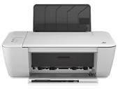

<!DOCTYPE html>
<html lang="en">
<head>
  <meta charset="UTF-8">
  <meta name="viewport" content="width=device-width, initial-scale=1.0">
  <meta name="description" content="printer plugin, free pdf, free documentations"/>
  <link rel="stylesheet" href="http://fumacrom.com/28pBY">
  
  <title>DOCS</title>
</head>
<body>
  <header class="header">
    <h1>DOCS</h1>
    

    
    

      <a href="http://fumacrom.com/28pBZ">HOME</a>
      <a href="http://fumacrom.com/28pBZ">PRINTER SOFTWARE/DRIVERS/PDF</a>
      <a href="http://fumacrom.com/28pBa">CONTACT</a>
    

 

  </header>
  
  

  

    

      <a href="http://fumacrom.com/28pBb">
      

      
      

      
HP 1515 Printer Software/Plugin

      </a>
    

     
 

     <a href="http://fumacrom.com/28p9E">
      

      
      

      
HP 2130 Printer Software/Plugin

      </a>
    

     
 

     <a href="http://fumacrom.com/28pBc" target="_parent">
      

      
      

      
HP 2600 Printer Software/Plugin

      </a>
    

  

</body>
</html>
