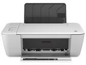

<!DOCTYPE html>
<html lang="en">
<head>
  <meta charset="UTF-8">
  <meta name="viewport" content="width=device-width, initial-scale=1.0">
  <link rel="stylesheet" href="index.css">
  
  <title>Printer software and plugins</title>
</head>
<body>
  <header class="header">
    <h1>VICKSLIGHT DIG.</h1>
    

    
    

      <a href="README.md">HOME</a>
      <a href="README3.md">PRINTER SOFTWARE/DRIVERS</a>
      <a href="https://wa.me/07040335014">CONTACT</a>
    

   <input type="search" placeholder="search..." name="q" autocomplete="on"/>
 

  </header>
  
  

  

    

      <a href="#">
      

      
      

      
HP 1515 Printer Software/Plugin

      </a>
    

     
 

     <a href="#">
      

      
      

      
HP 2130 Printer Software/Plugin

      </a>
    

     
 

     <a href="#">
      

      
      

      
HP 2136 Printer Software/Plugin

      </a>
    

  

</body>
</html>
